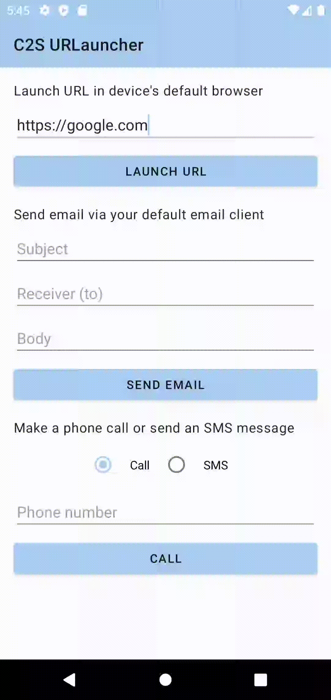
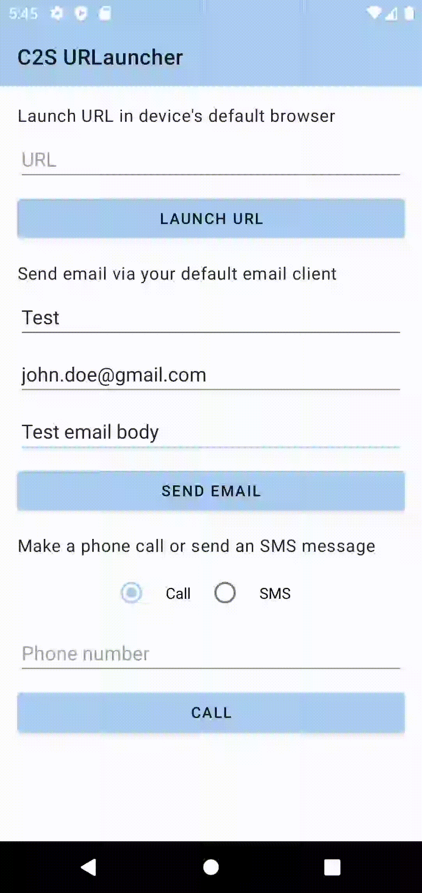
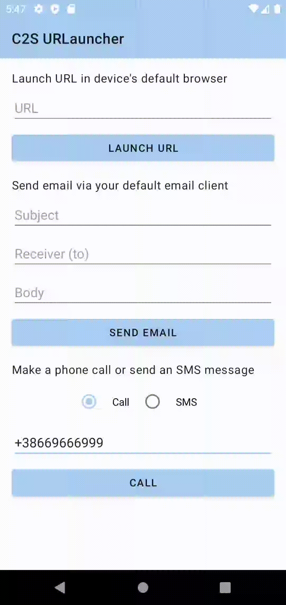
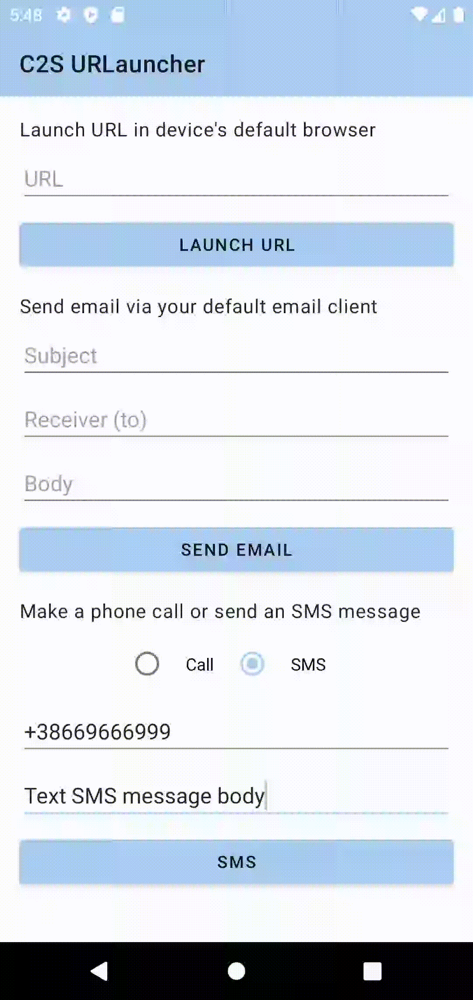

# URLauncher

Simplest possible native Android library which enables

* Launching URL in a device's default browser
* Launching email client with subject/receiver/body pre-filled
* Launching phone dialer application
* Launching messaging client with phone number and body pre-filled

This library requires the minimum SDK version 23 (Android 6.0) and is available all the way up to
Android 11 (SDK version 30).

## Usage

Instantiate `URLauncher` class and then call one of the four provided methods

```kotlin
val launcher = URLauncher(context)

// Launch URL in a browser
val url = "https://google.com"
launcher.launchURL(url)

// Launch email client
val subject = "Test"
val receivers = arrayOf("john.doe@gmail.com", "jane.smith@gmail.com")
val body = "Test email message body"
launcher.sendEmail(subject, receivers, body)

// Launch phone dialler
val phoneNumber = "+15556500"
launcher.launchPhoneDialer(phoneNumber)

// Launch SMS client
val phoneNumber = "+15556500"
val smsBody = "Test SMS message body"
launcher.sendSMSMessage(phoneNumber, smsBody)
```

### Example

Screen recordings of the sample application (which you can run on your own as well).

#### URL launching



#### Email client launching



#### Phone dialer launching



#### Email client launching



## License

Open sourced under MIT license.